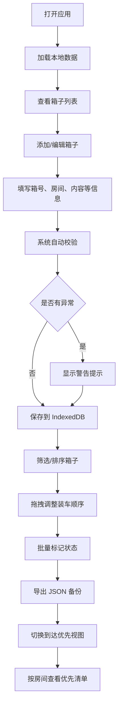

## 1. 产品概述

搬家箱清单整理工具是一个纯前端应用，帮助用户在搬家前系统化地整理、跟踪和管理所有搬家箱的信息。解决搬家过程中箱子混乱、物品丢失、易碎品损坏等痛点，提升搬家效率和体验。

## 2. 核心功能

### 2.1 用户角色

| 角色 | 注册方式 | 核心权限 |
|------|----------|----------|
| 普通用户 | 无需注册，本地存储 | 所有功能，数据本地存储 |

### 2.2 功能模块

1. **箱子管理**：箱子信息增删改查、复制相似箱子、批量状态标记
2. **筛选与排序**：多维度筛选、拖拽调整装车顺序
3. **数据校验**：自动检查箱号重复、装车顺序冲突等问题
4. **数据导出**：JSON 格式导出备份
5. **优先清单视图**：到达后需优先处理的箱子汇总

### 2.3 页面详情

| 页面名称 | 模块名称 | 功能描述 |
|-----------|-------------|---------------------|
| 主页面 | 顶部导航栏 | 视图切换（全部清单/到达优先）、导出按钮、添加箱子按钮 |
| 主页面 | 筛选器栏 | 按房间、重量、优先级、状态、是否易碎筛选 |
| 主页面 | 箱子列表 | 卡片式展示所有箱子，支持拖拽排序 |
| 主页面 | 箱子卡片 | 展示箱号、房间、内容、重量、易碎、优先级、装车顺序、状态、备注 |
| 主页面 | 批量操作栏 | 多选后批量标记"待整理""已确认""需加固""暂缓搬运" |
| 主页面 | 校验提醒 | 自动检测并展示数据异常警告 |
| 到达后优先清单 | 房间汇总 | 按房间统计箱子数量 |
| 到达后优先清单 | 优先列表 | 展示需优先打开、需加固、备注不完整的箱子 |

## 3. 核心流程

用户打开应用 → 查看/添加箱子 → 填写箱子信息 → 系统自动校验 → 按条件筛选 → 拖拽调整装车顺序 → 批量标记状态 → 导出 JSON 备份 → 切换到到达优先视图查看优先清单

## 4. 用户界面设计

### 4.1 设计风格

- **主色调**：温暖的琥珀色（搬家纸箱色）#d97706，搭配深蓝色 #1e3a5f 作为强调色
- **辅助色**：绿色 #16a34a（已确认）、橙色 #f97316（待整理）、红色 #dc2626（需加固）、灰色 #6b7280（暂缓搬运）
- **背景**：浅米黄色 #fef3c7 渐变，营造温馨搬家氛围
- **卡片风格**：圆角 12px，柔和阴影，悬停时轻微上浮
- **字体**：标题使用 "Noto Serif SC" 衬线字体，正文使用 "Noto Sans SC" 无衬线字体
- **图标风格**：使用 lucide-react 图标，线条柔和

### 4.2 页面设计概述

| 页面名称 | 模块名称 | UI Elements |
|-----------|-------------|-------------|
| 主页面 | 顶部导航 | 大标题、视图切换 tab、导出按钮、添加按钮 |
| 主页面 | 筛选器栏 | 水平排列的下拉筛选器，活跃状态高亮 |
| 主页面 | 箱子卡片 | 左：箱号标签 + 房间标签；中：内容摘要 + 重量；右：状态徽章 + 操作按钮 |
| 主页面 | 校验警告 | 顶部醒目的警告条，红色背景，可展开查看详情 |
| 到达优先视图 | 房间汇总卡片 | 大号数字 + 房间名 + 颜色编码 |
| 到达优先视图 | 优先清单 | 按优先级排序，高亮需加固和备注不完整项 |

### 4.3 响应式

- 桌面端优先设计（≥1024px）：3-4 列网格布局
- 平板端（768-1023px）：2 列网格布局
- 移动端（<768px）：单列布局，筛选器折叠为下拉菜单

### 4.4 交互细节

- 拖拽时半透明效果，放置区域高亮
- 卡片悬停时阴影加深、轻微上浮
- 状态切换时平滑过渡动画
- 校验警告滑入动画
- 添加/编辑模态框淡入缩放效果
