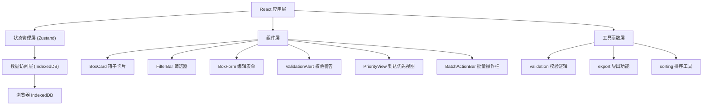
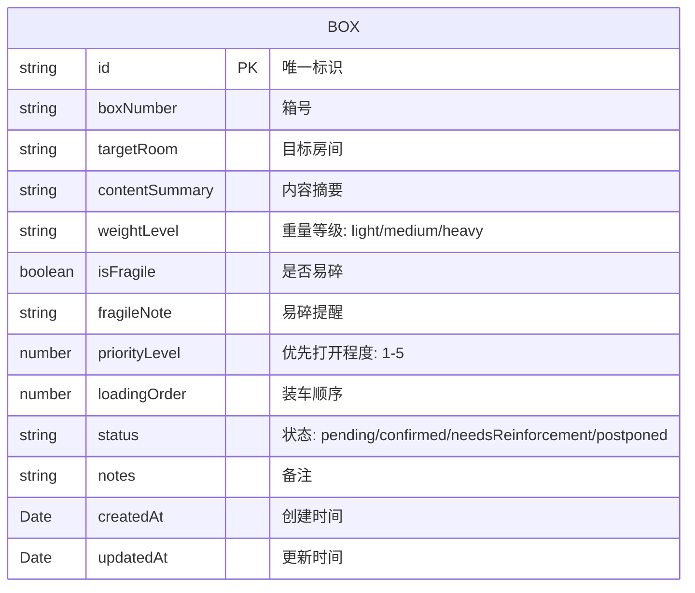

## 1. 架构设计



## 2. 技术描述

- **前端框架**：React@18 + TypeScript
- **构建工具**：Vite@5
- **样式方案**：TailwindCSS@3
- **状态管理**：Zustand@4
- **拖拽库**：@dnd-kit/core + @dnd-kit/sortable
- **图标库**：lucide-react
- **数据存储**：浏览器 IndexedDB（idb 库封装）
- **后端**：无，纯前端应用

## 3. 路由定义

| Route | Purpose |
|-------|---------|
| / | 主页面 - 全部箱子清单视图 |
| /priority | 到达后优先清单视图 |

## 4. 数据模型

### 4.1 数据模型定义



### 4.2 类型定义

```typescript
// 箱子状态枚举
type BoxStatus = 'pending' | 'confirmed' | 'needsReinforcement' | 'postponed';

// 重量等级枚举
type WeightLevel = 'light' | 'medium' | 'heavy';

// 箱子数据接口
interface Box {
  id: string;
  boxNumber: string;
  targetRoom: string;
  contentSummary: string;
  weightLevel: WeightLevel;
  isFragile: boolean;
  fragileNote: string;
  priorityLevel: 1 | 2 | 3 | 4 | 5;
  loadingOrder: number;
  status: BoxStatus;
  notes: string;
  createdAt: Date;
  updatedAt: Date;
}

// 筛选条件接口
interface FilterOptions {
  targetRoom: string | null;
  weightLevel: WeightLevel | null;
  priorityLevel: number | null;
  status: BoxStatus | null;
  isFragile: boolean | null;
}

// 校验警告接口
interface ValidationWarning {
  type: 'duplicateBoxNumber' | 'tooManyHeavyInRoom' | 'fragileWithoutNote' | 'duplicateLoadingOrder' | 'tooManyHighPriority';
  severity: 'error' | 'warning';
  message: string;
  affectedBoxIds: string[];
}
```

### 4.3 筛选条件

| 筛选维度 | 可选值 |
|---------|--------|
| 目标房间 | 卧室、客厅、厨房、卫生间、书房、储物间、其他 |
| 重量等级 | 轻量（<10kg）、中量（10-25kg）、重量（>25kg） |
| 优先程度 | 1-5 级（5 最高） |
| 确认状态 | 待整理、已确认、需加固、暂缓搬运 |
| 是否易碎 | 是 / 否 |

## 5. 核心模块结构

```
src/
├── components/
│   ├── BoxCard.tsx          # 箱子卡片组件
│   ├── BoxForm.tsx          # 箱子编辑表单（模态框）
│   ├── FilterBar.tsx        # 筛选器组件
│   ├── ValidationAlert.tsx  # 校验警告组件
│   ├── BatchActionBar.tsx   # 批量操作栏
│   ├── PriorityView.tsx     # 到达后优先清单视图
│   ├── RoomSummaryCard.tsx  # 房间汇总卡片
│   └── SortableBoxList.tsx  # 可拖拽排序列表
├── hooks/
│   ├── useBoxStore.ts       # Zustand 状态管理
│   └── useIndexedDB.ts      # IndexedDB 操作封装
├── utils/
│   ├── validation.ts        # 数据校验逻辑
│   ├── export.ts            # JSON 导出功能
│   └── constants.ts         # 常量定义（房间列表、状态映射等）
├── types/
│   └── index.ts             # 全局类型定义
├── App.tsx                  # 主应用组件（路由）
└── main.tsx                 # 入口文件
```

## 6. 校验规则说明

1. **箱号重复检查**：所有箱子的 boxNumber 必须唯一
2. **同房间重箱过多**：同一房间内 heavy 等级箱子超过 3 个时警告
3. **易碎却缺少提醒**：isFragile 为 true 但 fragileNote 为空时警告
4. **装车顺序重复**：loadingOrder 值重复时错误
5. **优先打开项过多**：priorityLevel 为 5 的箱子超过总数 20% 时警告
